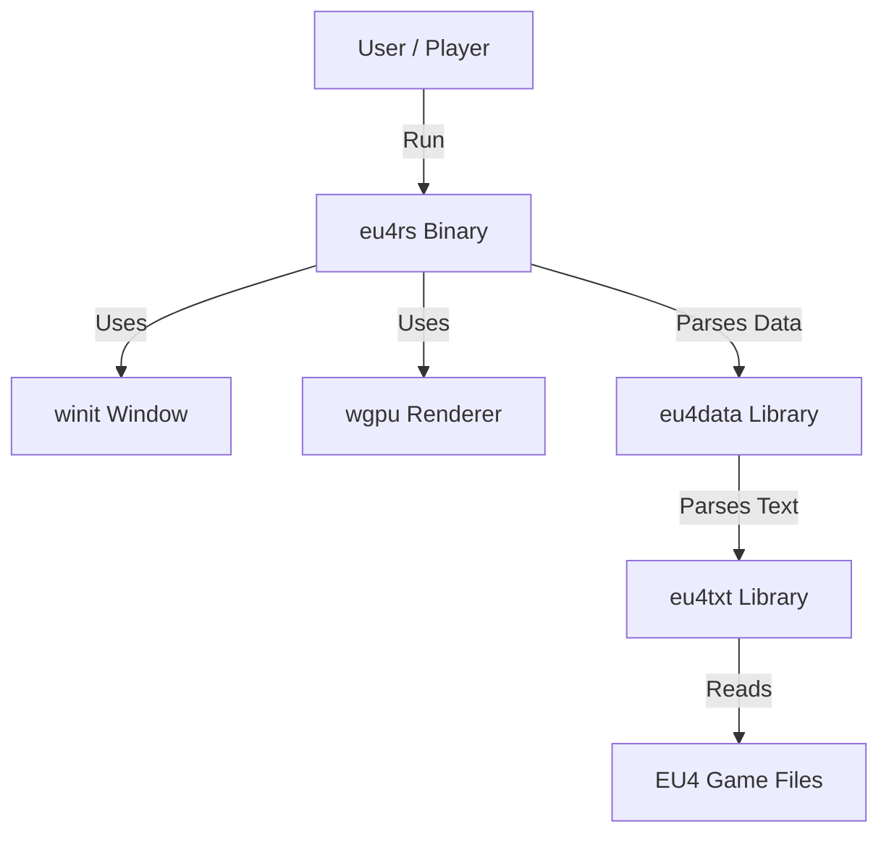

# eu4rs Documentation

Welcome to the architectural documentation for `eu4rs`. This project is a Rust-based source port and toolset for *Europa Universalis IV*.

## Overview

The project is divided into three main components:

1.  **[eu4rs](./eu4rs.md)**: The main executable binary. It handles the windowing, event loop, and rendering (Vulkan/WGPU) to display the game map.
2.  **[eu4data](./eu4data.md)**: A library for defining existing game data structures (Provinces, Countries, Trade Goods, etc.) and loading them from game files.
3.  **[eu4txt](./eu4txt.md)**: A library for parsing the custom text format used by EU4 data files.

## High-Level Architecture

## Quick Links

-   [Installation and Usage](../README.md#installation)
-   [Project Roadmap](./roadmap.md)
