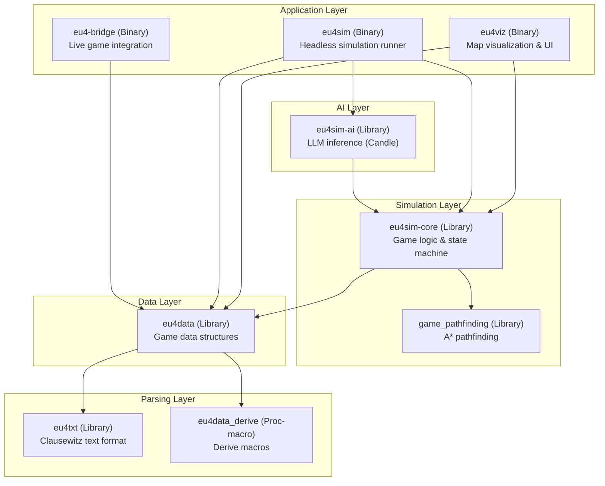
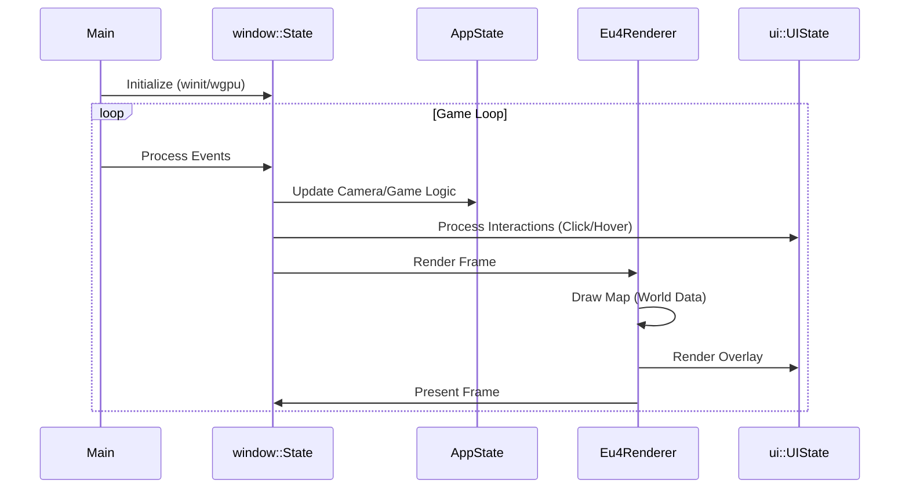
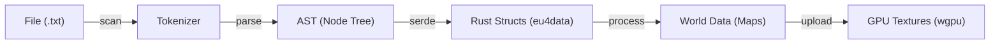
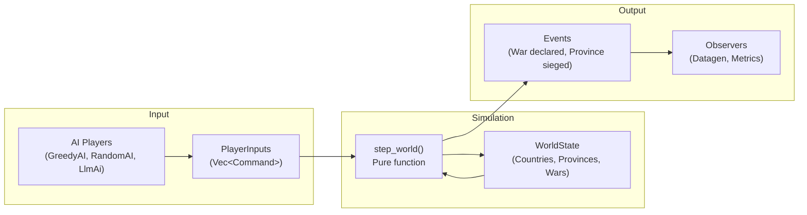
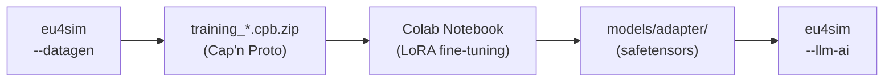

# System Architecture

This document provides a high-level overview of the `eu4rs` workspace architecture, including its crate structure, rendering pipeline, simulation engine, and data flow.

## 1. High-Level Structure

The project is organized as a Cargo workspace with multiple crates across four distinct layers:

### Crate Overview

| Crate | Type | Purpose |
|-------|------|---------|
| **eu4txt** | lib | Tokenizer/parser for Clausewitz WINDOWS-1252 text format |
| **eu4data_derive** | proc-macro | `#[derive(...)]` macros for eu4data structs |
| **eu4data** | lib | Game data structures (Country, Province, TradeGood, etc.) |
| **game_pathfinding** | lib | Generic A* pathfinding with pluggable cost functions |
| **eu4sim-core** | lib | Simulation engine: state, commands, AI traits, observers |
| **eu4sim-ai** | lib | LLM-based AI using Candle ML (SmolLM2, Gemma3) |
| **eu4viz** | bin | GPU-rendered map viewer with egui UI |
| **eu4sim** | bin | Headless simulation runner for benchmarks/training |
| **eu4-bridge** | bin | Screen capture + OCR for live game integration |
| **xtask** | bin | Build automation (CI, coverage, codegen) |

### Layer Responsibilities

*   **Parsing Layer** (`eu4txt`, `eu4data_derive`): Raw text parsing and code generation. No game semantics.
*   **Data Layer** (`eu4data`): Strongly-typed game data structures. Loads from EU4 installation or savegames.
*   **Simulation Layer** (`eu4sim-core`, `game_pathfinding`): Deterministic game logic. Pure functional core with command/event architecture.
*   **AI Layer** (`eu4sim-ai`): Machine learning inference. Pluggable via `AiPlayer` trait.
*   **Application Layer** (`eu4viz`, `eu4sim`, `eu4-bridge`): User-facing binaries. Thin shells over library logic.

## 2. Application Loop (`eu4viz`)

The `eu4viz` application follows a typical game loop architecture, driven by `winit` events.

### Key Modules
*   **`window.rs`**: Manages the `wgpu` surface and `winit` event loop. It owns `AppState` (logic) and `Eu4Renderer` (graphics).
*   **`renderer.rs`**: Abstraction over `wgpu`. Manages pipelines, textures, and uniform buffers.
*   **`ui.rs`**: Transient UI state (sidebar, console). Renders into a texture that is overlayed on the map.
*   **`state.rs` (`AppState`)**: Persistent game state (camera position, loaded world data).

## 3. Data Loading Pipeline

Loading data is a multi-step process that transforms raw text into renderable textures.

## 4. Rendering Pipeline

The rendering engine uses `wgpu` (Vulkan/Metal/DX12) and currently employs a simple 2D layering strategy.

1.  **Map Pass**: Renders the base map texture (Province, Political, etc.) to the screen.
    *   Uses a dedicated `render_pipeline`.
    *   Sampled with `Nearest` neighbor to preserve pixel art borders.
2.  **UI Pass**: Renders the UI overlay.
    *   UI elements are drawn to an RGBA CPU buffer (`image` crate).
    *   Uploaded to a dynamic texture.
    *   Composited on top of the map.

## 5. Threading Model

*   **Main Thread**: Handles Window pump, Event Loop, and Rendering submissions.
*   **Loading Thread**: Spawns initially to parse thousands of files without freezing the window. Communicates via a `mpsc::channel` to send the completed `WorldData` back to the main thread.
*   **Datagen Thread**: When training data generation is enabled, samples are written asynchronously via a background thread.

## 6. Simulation Engine (`eu4sim-core`)

The simulation layer implements a deterministic, command-based game engine.

### Core Architecture

### Key Modules

| Module | Purpose |
|--------|---------|
| `state.rs` | Core game state: `WorldState`, `CountryState`, `ProvinceState` |
| `input.rs` | Command enum: `Move`, `DeclareWar`, `BuyTech`, etc. |
| `step.rs` | Pure `step_world(state, inputs) -> state` function |
| `ai/` | AI player trait and implementations (Greedy, Random, LLM) |
| `observer/` | Side-effect handlers: training data, metrics, logging |
| `systems/` | Game subsystems: combat, diplomacy, economy |
| `trade.rs` | Trade node simulation and merchant routing |
| `fixed.rs` | Fixed-point arithmetic for determinism |

### Command Flow

1. **AI Decision**: Each AI player receives `VisibleWorldState` and returns `Vec<Command>`
2. **Validation**: Commands are validated against game rules
3. **Execution**: `step_world()` applies commands to state
4. **Observation**: Observers record state transitions for training/metrics

### Multi-Command Support

AI players can submit multiple commands per tick:
- **1 Diplomatic** action (declare war, offer peace)
- **N Military** moves (each army can move)
- **1 Economic** action (tech, development)
- **N Trade** actions (merchant sends)
- **N Colonization** actions (start colonies)

Commands are categorized via `CommandCategory` enum and processed by category.

## 7. AI System (`eu4sim-ai`)

The AI layer provides machine learning-based decision making.

### Supported Models

| Model | Size | Use Case |
|-------|------|----------|
| SmolLM2-360M | 360M params | Default, fast inference |
| Gemma-3-270M | 270M params | Alternative architecture |

### Training Pipeline

### Inference Flow

1. `LlmAi` receives `VisibleWorldState` and `AvailableCommands`
2. State is formatted as a text prompt
3. Model generates action index(es) as text
4. Output is parsed back to `Vec<Command>`

---

*Last updated: 2025-12-23*
