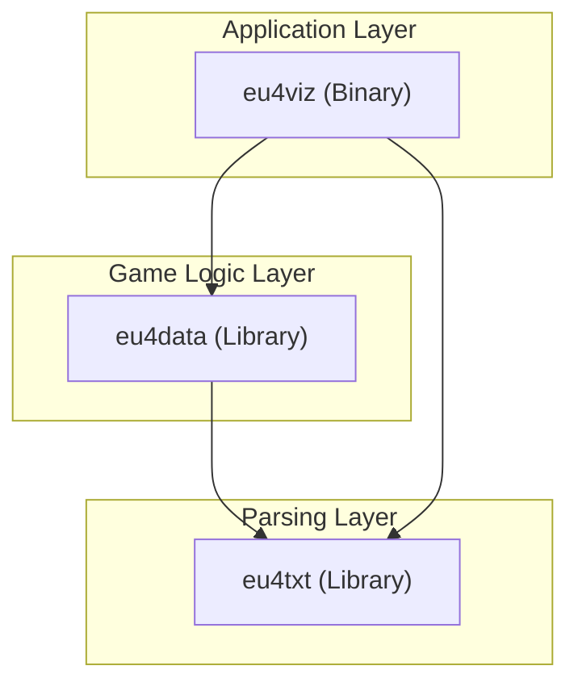

# System Architecture

This document provides a high-level overview of the `eu4rs` workspace architecture, including its crate structure, rendering pipeline, and data flow.

## 1. High-Level Structure

The project is organized as a Cargo workspace with three primary crates, ensuring a separation of concerns between raw parsing, game logic, and the application layer.

*   **`eu4txt`**: The foundation. A fault-tolerant tokenizer and parser for the specific Windows-1252 text format used by Clausewitz engine games.
*   **`eu4data`**: The semantics. Defines Rust structs (`Country`, `Province`, `TradeGood`) and logic for loading them from directories. Uses `eu4txt` for deserialization.
*   **`eu4viz`**: The runtime. Handles the windowing (`winit`), rendering (`wgpu`), user input, and UI orchestration.

## 2. Application Loop (`eu4viz`)

The `eu4viz` application follows a typical game loop architecture, driven by `winit` events.

### Key Modules
*   **`window.rs`**: Manages the `wgpu` surface and `winit` event loop. It owns `AppState` (logic) and `Eu4Renderer` (graphics).
*   **`renderer.rs`**: Abstraction over `wgpu`. Manages pipelines, textures, and uniform buffers.
*   **`ui.rs`**: Transient UI state (sidebar, console). Renders into a texture that is overlayed on the map.
*   **`state.rs` (`AppState`)**: Persistent game state (camera position, loaded world data).

## 3. Data Loading Pipeline

Loading data is a multi-step process that transforms raw text into renderable textures.

## 4. Rendering Pipeline

The rendering engine uses `wgpu` (Vulkan/Metal/DX12) and currently employs a simple 2D layering strategy.

1.  **Map Pass**: Renders the base map texture (Province, Political, etc.) to the screen.
    *   Uses a dedicated `render_pipeline`.
    *   Sampled with `Nearest` neighbor to preserve pixel art borders.
2.  **UI Pass**: Renders the UI overlay.
    *   UI elements are drawn to an RGBA CPU buffer (`image` crate).
    *   Uploaded to a dynamic texture.
    *   Composited on top of the map.

## 5. Threading Model

*   **Main Thread**: Handles Window pump, Event Loop, and Rendering submissions.
*   **Loading Thread**: Spawns initially to parse thousands of files without freezing the window. Communicates via a `mpsc::channel` to send the completed `WorldData` back to the main thread.
