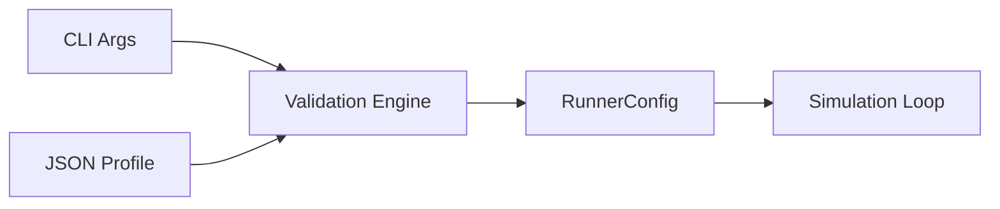

# CLI Argument Pipeline

To ensure the simulation is robustly configurable and testable, `eu4sim` uses a multi-stage pipeline for processing command-line arguments.

## Pipeline Overview

1.  **Raw CLI (`args`)**: Captured using `clap::Parser`. This includes all raw flags, optional paths, and legacy overrides.
2.  **Simulation Profile (`JSON`)**: Optional configuration file that can set any parameter. CLI flags usually override profile settings.
3.  **RunnerConfig (`Typed`)**: A final, validated, and resolved configuration object. This is what the simulation loop actually consumes.

## Benefits

-   **Testability**: We can unit test the logic of "If `--full-game` is set, ignore `--ticks`" without actually running the simulation.
-   **Profiles**: Heavy stress tests or specific scenarios can be saved as JSON profiles and run via `--profile stress_test.json`.
-   **Predictability**: The simulation loop doesn't have to worry about parsing strings or checking conflicting flags; it receives a clean `RunnerConfig`.
