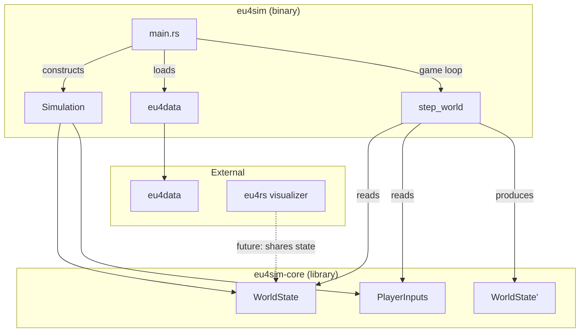
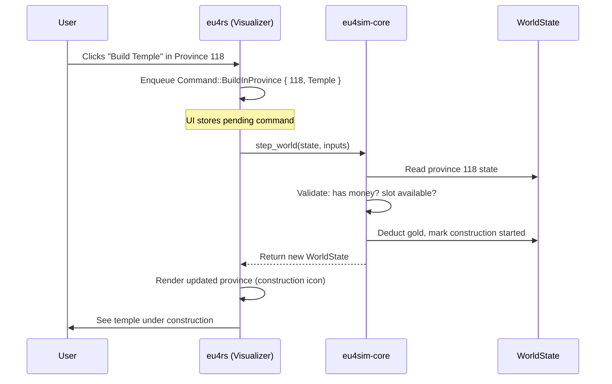

# Simulation Engine Design

The simulation engine is the core game logic layer, completely decoupled from graphics and user interfaces. It implements a pure state-transition model: given the current world state and player inputs, compute the next world state.

## Architecture Overview



## Core Interface

The simulation's main interface is a pure function:

```rust
/// Advance the world by one tick (typically one day in EU4 terms).
pub fn step_world(state: &WorldState, inputs: &PlayerInputs) -> WorldState
```

**Key properties:**
- **Deterministic**: Same state + inputs always produces same output
- **Pure**: No side effects, no I/O, no randomness (RNG state is part of WorldState)
- **Decoupled**: Knows nothing about rendering, UI, or persistence

## WorldState

The complete, serializable state of the simulated world at a point in time:

```rust
pub struct WorldState {
    /// Current simulation date
    pub date: Date,
    
    /// Random number generator state (for reproducibility)
    pub rng_seed: u64,
    
    /// Province states (ownership, population, buildings, etc.)
    pub provinces: HashMap<ProvinceId, ProvinceState>,
    
    /// Country states (treasury, tech, diplomacy, etc.)
    pub countries: HashMap<Tag, CountryState>,
    
    /// Active wars, truces, alliances
    pub diplomacy: DiplomacyState,
    
    /// Global modifiers, events in progress
    pub global: GlobalState,
}
```

## PlayerInputs

Actions the player (or AI) wants to take this tick:

```rust
pub struct PlayerInputs {
    /// Which country is issuing these commands
    pub country: Tag,
    
    /// Commands to execute this tick
    pub commands: Vec<Command>,
}

pub enum Command {
    // Economic
    BuildInProvince { province: ProvinceId, building: BuildingType },
    SetMerchant { trade_node: TradeNodeId, action: MerchantAction },
    RaiseTaxes { province: ProvinceId },
    
    // Military  
    RecruitUnit { province: ProvinceId, unit_type: UnitType },
    MoveArmy { army_id: ArmyId, destination: ProvinceId },
    DeclareWar { target: Tag, casus_belli: CasusBelli },
    
    // Diplomatic
    SendDiplomat { target: Tag, action: DiplomaticAction },
    AcceptPeace { war_id: WarId },
    
    // Internal
    SetNationalFocus { focus: NationalFocus },
    PassLaw { law: LawType },
}
```

## Command Validation

The UI often needs to know *before* a tick whether an action is valid—e.g., to grey out a "Build Temple" button if the player lacks funds. Rather than duplicating validation logic, `eu4sim-core` exposes a cheap query interface:

```rust
/// Check if a command can be executed in the current state.
/// Returns Ok(()) if valid, or Err with a reason if not.
pub fn can_execute(state: &WorldState, country: Tag, cmd: &Command) -> Result<(), ActionError>

/// Batch query: check multiple commands at once (useful for UI panels).
pub fn can_execute_batch(
    state: &WorldState, 
    country: Tag, 
    cmds: &[Command]
) -> Vec<Result<(), ActionError>>
```

**ActionError** provides structured feedback:

```rust
pub enum ActionError {
    InsufficientFunds { required: f32, available: f32 },
    ProvinceNotOwned { province: ProvinceId },
    BuildingSlotFull { province: ProvinceId },
    AtWar { with: Tag },
    OnCooldown { remaining_days: u32 },
    TechRequired { tech: TechType, level: u8 },
    // ... etc
}
```

**Key design properties:**
- **Read-only**: `can_execute` never mutates state
- **Fast**: O(1) lookups, no simulation logic
- **Same logic**: `step_world` internally uses `can_execute` before applying commands—no duplication

**UI usage pattern:**

```rust
// In the visualizer's render loop (every frame)
let can_build = eu4sim_core::can_execute(
    &world_state, 
    player_country, 
    &Command::BuildInProvince { province: 118, building: Temple }
);

// Render button based on result
match can_build {
    Ok(()) => draw_button_active("Build Temple"),
    Err(ActionError::InsufficientFunds { required, .. }) => {
        draw_button_disabled(&format!("Build Temple (need {} gold)", required))
    }
    Err(e) => draw_button_disabled(&e.to_string()),
}
```

This keeps validation logic in one place (the simulation library) while letting the UI query it cheaply every frame.

## Binary Structure

```
eu4rs/
├── eu4sim/                  # NEW: Simulation binary crate
│   ├── Cargo.toml
│   └── src/
│       └── main.rs          # Game loop, CLI interface
│
├── eu4sim-core/             # NEW: Simulation library crate
│   ├── Cargo.toml
│   └── src/
│       ├── lib.rs
│       ├── state.rs         # WorldState definition
│       ├── input.rs         # PlayerInputs, Command enum
│       ├── step.rs          # step_world implementation
│       ├── systems/         # Individual simulation systems
│       │   ├── economy.rs
│       │   ├── military.rs
│       │   ├── diplomacy.rs
│       │   └── events.rs
│       └── ai/              # AI decision-making (optional)
│           └── mod.rs
│
├── eu4data/                 # Existing: Game data loading
├── eu4rs/                   # Existing: Visualizer
└── eu4txt/                  # Existing: Parser
```

## Main Entry Point

The `eu4sim` binary orchestrates the simulation:

```rust
// eu4sim/src/main.rs

fn main() -> Result<()> {
    let args = Args::parse();
    
    // 1. Load static game data
    let game_data = eu4data::load_game_data(&args.game_path)?;
    
    // 2. Initialize world state (from save or fresh start)
    let mut state = if let Some(save) = args.load_save {
        WorldState::load(&save)?
    } else {
        WorldState::from_game_data(&game_data, args.start_date)?
    };
    
    // 3. Game loop
    loop {
        // Gather inputs (from CLI, file, or AI)
        let inputs = gather_inputs(&state, &args)?;
        
        // Step simulation
        state = eu4sim_core::step_world(&state, &inputs);
        
        // Check termination
        if state.date >= args.end_date || inputs.commands.contains(&Command::Quit) {
            break;
        }
        
        // Optional: save checkpoints, emit events, etc.
        if state.date.day == 1 {
            log::info!("Simulated to {}", state.date);
        }
    }
    
    // 4. Output final state
    state.save(&args.output)?;
    Ok(())
}
```

## Connecting to the Visualizer (Future)

The visualizer (`eu4rs`) could consume simulation state in several ways:

1. **Shared state file**: Simulation writes, visualizer reads
2. **IPC/socket**: Real-time state streaming
3. **Embedded**: Visualizer imports `eu4sim-core` and runs simulation inline

The key is that `eu4sim-core` remains pure—it doesn't know how its output is consumed.

## Example: What Happens When a User Builds a Temple



## Open Questions

1. **Tick granularity**: Daily vs monthly ticks? (EU4 uses daily)
2. **AI integration**: Part of `eu4sim-core` or separate crate?
3. **Save format**: Binary (fast) vs JSON (debuggable)?
4. **Parallelism**: Can province updates run in parallel?
5. **Event system**: How do events/decisions integrate with `Command`?

## Next Steps

1. [ ] Create `eu4sim-core` crate with stub types
2. [ ] Implement `WorldState` with minimal fields
3. [ ] Implement one system (e.g., basic economy tick)
4. [ ] Create `eu4sim` binary with headless game loop
5. [ ] Add integration test: run 10 ticks, verify determinism
